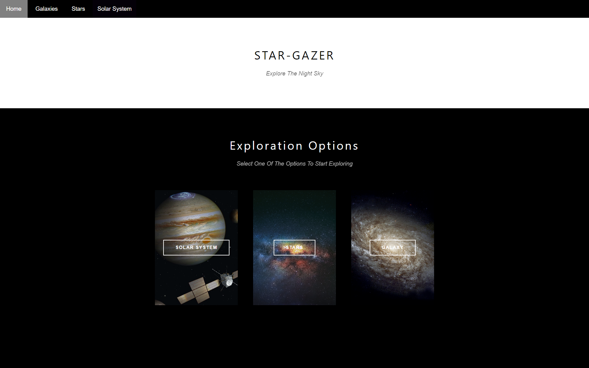
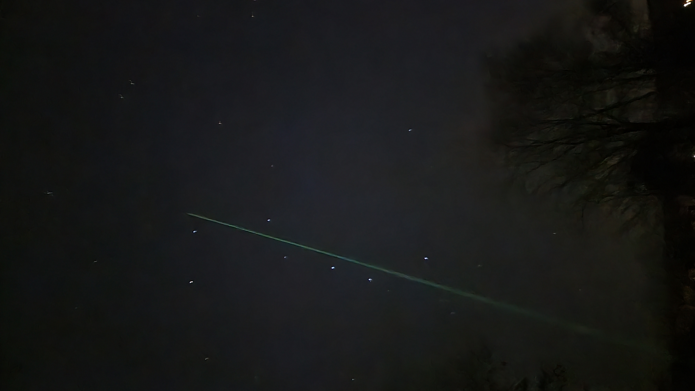
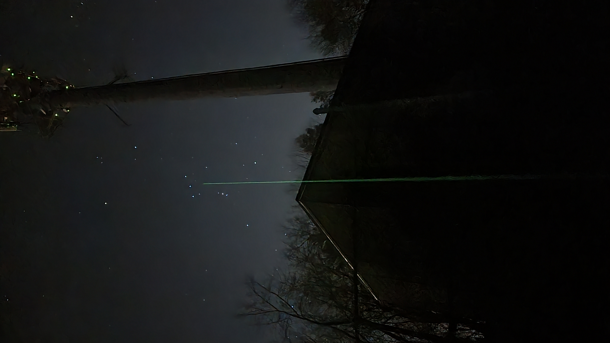
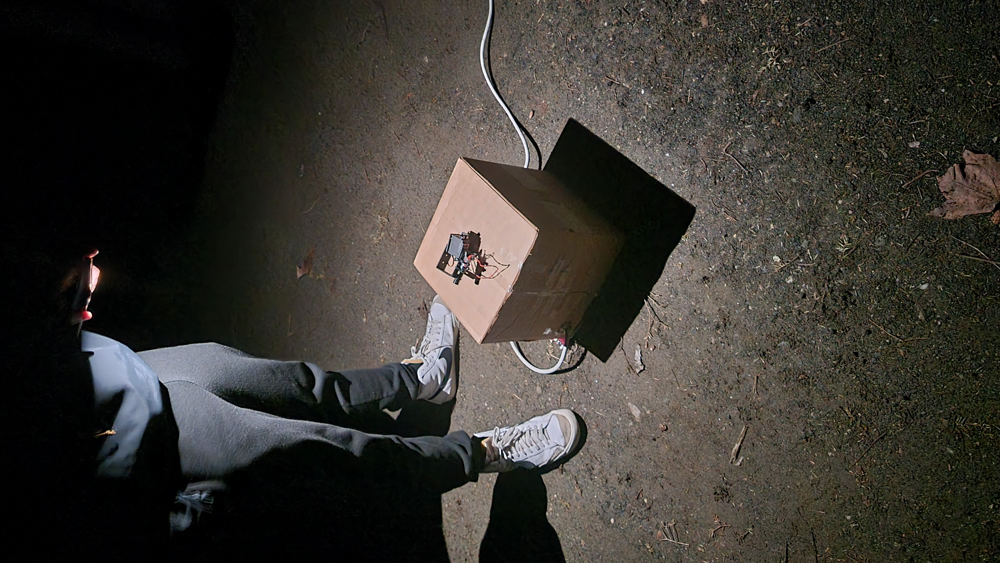
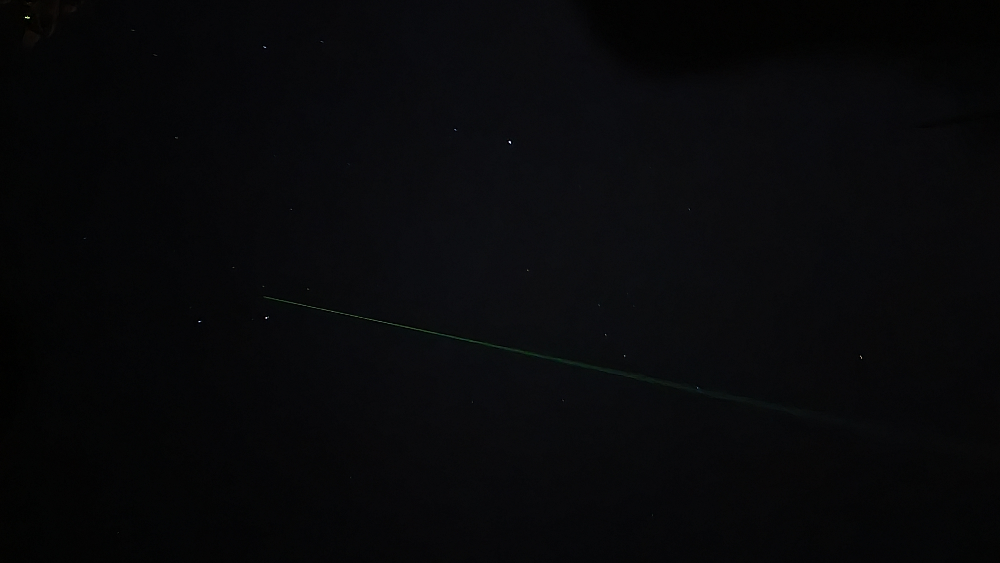

# 
 Stargazer: Your Guide to The Sky 

## Overview
Stargazer is a project done in collaboration between Omer Sezer and Georges Ouweijan during the winter break between the Fall 2022 and Spring 2023 semesters.
It allows users to go to a website, pair with a Raspberry Pi controlling two servo motors and a laser, and instruct it to point at any object in the night sky from stars to planets to asteroids to galaxies.

The server was written using the Java Spring framework, while the website was created with vanilla JavaScript, HTML, and CSS, and the Raspberry Pi ran Python.

When a user searches or clicks on an astronomical body they wish to see, the website sends a message containing the name and id (if it is known) of the object to the server via a WebSocket.
The server then searches for the coordinates of that object using the JPL Horizons API for bodies within our solar system, or SIMBAD API for extrasolar objects, and converts those absolute coordinates into the coordinates in the sky for the user's location.
Then the server instructs the Raspberry Pi to point to those coordinates and the magic happens!

The device is able to point to an object within a few degrees, enabling users to understand where everything is in the sky!

The server rejects requests to point to objects if it has seen any aircraft within the past five minutes, improving safety.

## Use Images
<table>
<tr>
<td></td>
<td></td>
<td></td>
<td></td>
</tr>
</table>

## Website GIFs

### Site Tour

 
### Site Usage

