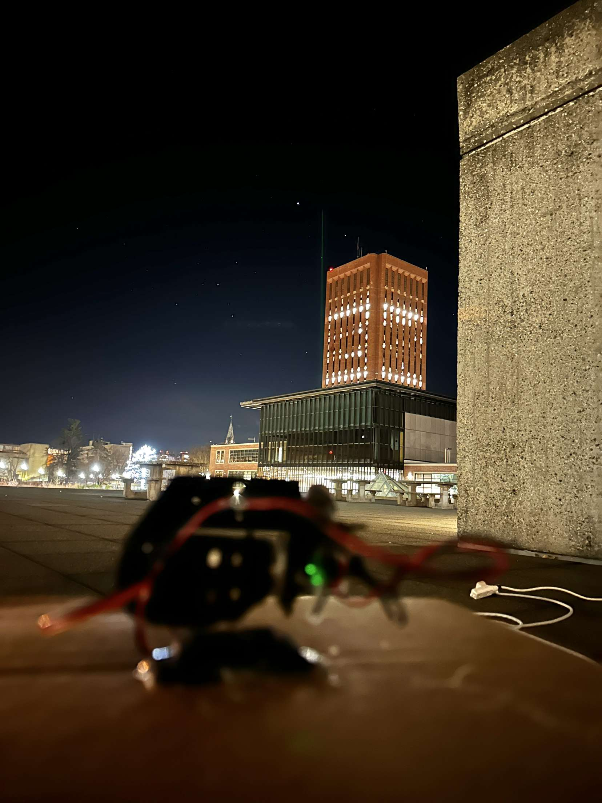
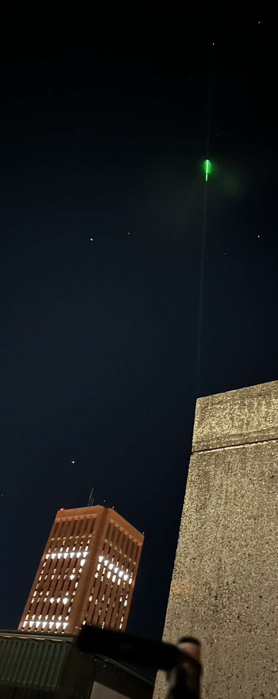

# Stargazer: Your guide to the sky

Stargazer is a project done in collaboration between Omer Sezer and Georges Ouweijan during the winter break between the Fall 2022 and Spring 2023 semesters.
It allows users to go to a website, pair with a raspberry pi controlling two servos and a laser, and instruct it to point at any object in the sky, from stars to planets to asteroids to galaxies.

The application is broken into three main components: the server which is implemented utilizing Java Spring, the website which is implemented in HTML and vanilla JavaScript, and the code controlling the motors and laser which is implemented in Python.

## Use Images

## Website Images
